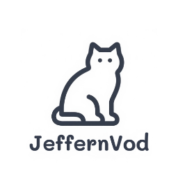

# 🎬 JeffernTV - Android TV 影视平台

<p align="center">
  
</p>

<p align="center">
  
  
  
  
</p>

---

## 📖 项目简介

**JeffernTV** 是一款专为 Android TV 平台开发的影视播放应用，基于原生 Android 技术栈（Java + Android SDK）构建。应用主要用于连接和观看 Emby 媒体服务器内容，为用户提供便捷的大屏观影体验。
<p align="center">

</p>
<p align="center">

</p>
<p align="center">

</p>

### ✨ 核心特性

- 🎯 **专为 Android TV 优化** - 完美适配电视遥控器操作
- 🔗 **Emby 服务器支持** - 无缝连接 Emby 媒体服务器
- 🚀 **自动登录功能** - 保存凭据，自动完成登录流程
- 💾 **智能缓存管理** - 优化加载速度，支持缓存清理
- 🎮 **遥控器友好** - 完整的方向键和确认键支持,自动执行遥控器无法操作的模块，使用遥控器完美适配
- 🔧 **灵活配置** - 支持自定义Emby服务器地址和登录信息

---

## 🧭 用户指南

### 首次使用

1. **启动应用** - 首次运行会显示配置界面
2. **配置 Emby 服务器**：
   - 输入 Emby 服务器地址（支持 HTTP/HTTPS）
   - 填写用户名和密码
   - 点击"确认"保存配置
3. **开始观影** - 配置完成后自动跳转到 Emby 界面
4. **重置影视** - 配置完成后在设置中清除缓存或者重新安装应用

### 功能操作

#### 🎮 遥控器操作
- **方向键** - 导航页面元素
- **确认键/回车** - 选择和播放
- **返回键** - 返回上一页面
- **菜单键** - 打开设置选项

#### ⚙️ 设置选项（按菜单键）
- **更换 User-Agent** - 切换设备标识
  - Android TV（推荐）
  - Android 手机
  - Android 平板
  - 自动检测
- **清除缓存** - 清理应用缓存数据
- **重新加载页面** - 刷新当前页面
- **返回主页** - 退出到配置界面

#### 🔧 重新配置

如需更换服务器或重新设置：
1. 配置完成后在设置中清除缓存或者重新安装应用

---

## 🛠️ 技术栈

- **开发语言**: Java
- **平台框架**: Android SDK
- **UI 框架**: Android Leanback Library
- **网络组件**: WebView + WebKit
- **构建工具**: Gradle
- **最低版本**: Android 5.0 (API 21)
- **目标版本**: Android 14 (API 34)

### 核心依赖

```gradle
implementation 'androidx.leanback:leanback:1.0.0'
implementation 'androidx.webkit:webkit:1.9.0'
implementation 'androidx.appcompat:appcompat:1.6.1'
implementation 'com.google.android.material:material:1.11.0'
```

---

## 🏗️ 开发指南

### 环境要求

- **Android Studio** 4.0 或更高版本
- **JDK** 8 或更高版本
- **Android SDK** API 21-34
- **Gradle** 7.0 或更高版本

### 构建步骤

1. **克隆项目**
   ```bash
   git clone https://github.com/jeffernn/JeffernTV.git
   cd JeffernTV
   ```

2. **导入 Android Studio**
   - 打开 Android Studio
   - 选择 "Open an existing project"
   - 选择项目目录

3. **构建应用**
   ```bash
   ./gradlew assembleDebug
   ```

4. **安装到设备**
   ```bash
   ./gradlew installDebug
   ```

### 项目结构

```
app/
├── src/main/
│   ├── java/com/jeffern/movie/
│   │   ├── MainActivity.java          # 主活动（配置界面）
│   │   ├── WebViewActivity.java       # WebView 播放界面
│   │   ├── PreferenceManager.java     # 偏好设置管理
│   │   ├── CacheManager.java          # 缓存管理
│   │   └── UninstallReceiver.java     # 卸载监听
│   ├── res/
│   │   ├── layout/                    # 布局文件
│   │   ├── values/                    # 资源文件
│   │   └── drawable/                  # 图标资源
│   └── AndroidManifest.xml           # 应用清单
└── build.gradle                      # 构建配置
```

---

## 📱 安装说明

### 从源码构建

1. 按照上述开发指南构建 APK
2. 将 APK 传输到 Android TV 设备
3. 在设备上启用"未知来源"安装
4. 安装 APK 文件

### 系统要求

- **Android TV** 5.0 或更高版本
- **内存**: 建议 2GB 或以上
- **存储**: 至少 50MB 可用空间
- **网络**: 稳定的网络连接

---

## ⚠️ 重要声明

- 本项目仅供学习和个人使用
- 请勿用于商业用途或公开服务
- 用户需自行承担使用责任
- 项目开发者不对用户行为承担法律责任
- 请遵守当地法律法规

---

## 🤝 贡献指南

欢迎提交 Issue 和 Pull Request！

1. Fork 本项目
2. 创建特性分支 (`git checkout -b feature/AmazingFeature`)
3. 提交更改 (`git commit -m 'Add some AmazingFeature'`)
4. 推送到分支 (`git push origin feature/AmazingFeature`)
5. 打开 Pull Request

---

## 📄 许可证

本项目采用 MIT 许可证 - 查看 [LICENSE](LICENSE) 文件了解详情

---

## 🚀 相关项目

- [macos版]([https://github.com/jeffernn/MoonTV](https://github.com/jeffernn/LibreTV-MoonTV-Mac-Objective-C)) - macos版的封装影视平台
- [LibreTV-Mac-Python]([https://github.com/jeffernn/LibreTV-Mac-Python](https://github.com/jeffernn/LibreTV-Mac-Python)) - 可以自行打包为windows版本


---

### ✨✨✨福利

- 啦啦～
- 看到这里啦！说明你认真熟读了README，我必须送你一些专属福利～
- ⬇️⬇️Emby客户端（macos/ipados/ios）高级订阅会员破解脚本⬇️⬇️
- https://github.com/jeffernn/jeffern-qx/blob/main/%E9%87%8D%E5%86%99/Embypremiere/Embypremiere.conf
- 配合Quantumult x使用，懂得都懂！切勿外传哦～

---

### 🚨 重要声明

- 本项目仅供学习和个人使用
- 请勿用于商业用途或公开服务（**禁止用于任何商业用途**）
- 如因公开分享导致的任何法律问题，用户需自行承担责任
- 项目开发者不对用户的使用行为承担任何法律责任
- 如有问题或建议，欢迎提交 Issue
- 如需分支项目请引用本项目地址
- 其他端（windows）的部署可参考[LibreTV-Mac-Python](https://github.com/jeffernn/LibreTV-Mac-Python)版本进行修改后自行打包
- 喜欢的话欢迎 Star🌟🌟🌟～


---

## ⚠️ 免责声明

JeffernMovie 仅作为视频搜索工具，不存储、上传或分发任何视频内容。所有视频均来自第三方影视站提供的搜索结果。如有侵权内容，请联系相应的内容提供方。

本项目开发者不对使用本项目产生的任何后果负责。使用本项目时，您必须遵守当地的法律法规。


## 📞 联系方式

如有问题或建议，欢迎通过以下方式联系：

- 📧 提交 [Issue](https://github.com/jeffernn/JeffernTV/issues)

---

## 🚀 欢迎加入我们的 Telegram 社区！

[](https://t.me/+vIMxDGDIWiczMTE1)

欢迎加入我们的 Telegram 群，获取最新动态、分享创意、与志同道合的朋友交流！🌟

---

<p align="center">
  <b>⭐ 如果这个项目对你有帮助，请给个 Star 支持一下！</b>
</p>
